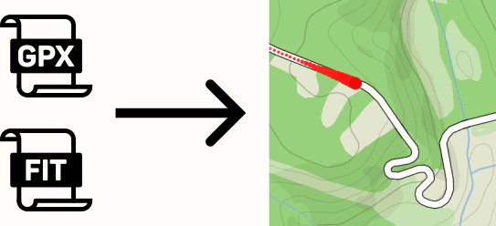

This project provides easy-to-use set of tools for visual processing of your GPS data. For now, GPX and FIT formats are supported. The maps are sourced from Mapbox and in order to use it you need to create a free account there. Then, you can create your own custom map styles using the Mapbox Studio which provides you with the last two neccessary pieces: your token ID and your custom map style ID. These credentials along with your Mapbox username are then passed to the tools provided here and rendering of image frames may begin.

Downloaded map tiles are cached/saved on local disk by your specification.

Output consists of two image sequences: map-image frame sequence and timestamp image sequence. Those can be the used software like Davinci Resolve to create videos or animations along with you GoPro camera footage, for example. An example of such use can be found here: https://youtu.be/QCelI4TwC4U

